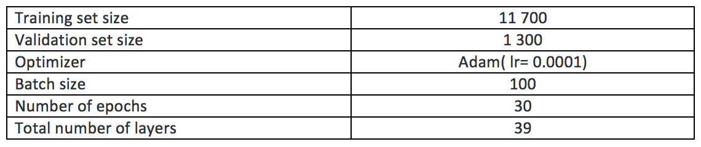
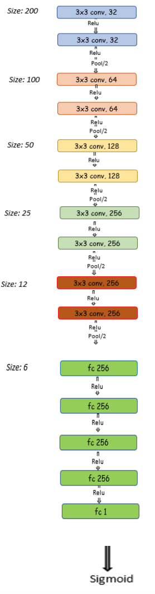
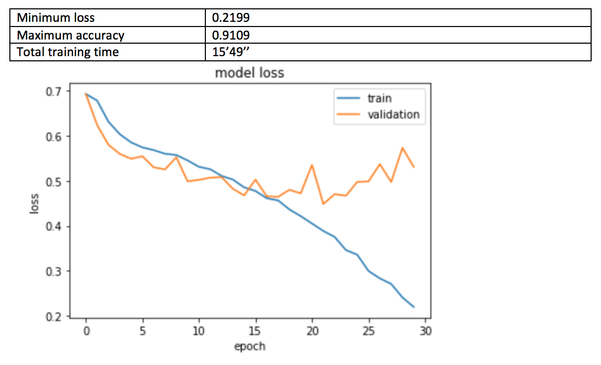
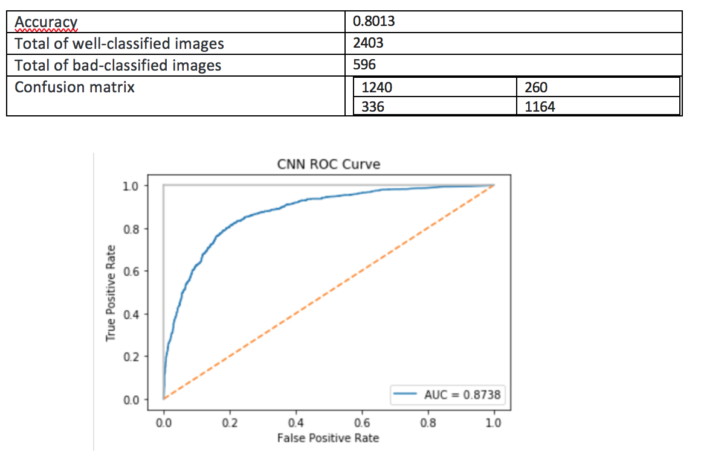

# CNN-DolphinShark

## Description

This project is an image classifier using Convolutional Neural Network (CNN). The **Model.hdf5** file is able to classify dolphins and sharks images with **80% of accuracy**.  
  
The dataset used is composed of:
- training: 6500 dolphin images / 6500 shark images
- validation: 650 / 650
- test: 1500 / 1500  

To have more details, please check **cnn.ipynb**.

## Parameters

## Architecture

## Results

### Training

### Test

  
